# Rubabox - Manage All File in One System


Rubabox adalah sebuah sistem penyimpanan file berbasis aplikasi web untuk Rupbasan Kelas 1 Bandung dengan beragam fitur yang mudah digunakan dan efisien. Rubabox memungkinkan kita menyimpan atau mengupload file di server melalui koneksi database. Tujuan dibuatnya Rubabox adalah untuk mengurangi penggunaan kertas untuk arsip dan mempercepat efisiensi pekerjaan yang berada di Rupbasan Kelas 1 Bandung.

## Table of Contents

- [Run Locally](#run-locally)
- [Tech Stack](#tech-stack)
- [Features](#features)

## Run Locally

**Step 1:**

Clone the project
```bash
  git clone https://link-to-project
```
**Step 2:**

Go to the project directory
```bash
  cd my-project
```

**Step 3:**

Install dependencies
```bash
  composer dump-autoload
```
or 
```bash
  composer update
```
**Step 4:**

Copy .env.example for get .env file
```bash
  cp .env.example .env
```
**Step 5:**

Run or start XAMPP 

**Step 6:**

Start the server
```bash
  php artisan serve
```


## Tech Stack

### Frontend:
- [Laravel](https://laravel.com/)
- [Bootstrap](https://getbootstrap.com/)
- [Iconify](https://docs.iconify.design/)
- [Google Fonts](https://fonts.google.com/)

### Backend:
- [Laravel](https://laravel.com/)
- [MySQL](https://www.mysql.com/)

### Other:
- [Figma (UI/UX Web Design)](https://www.figma.com/)

## Features

* Home Page
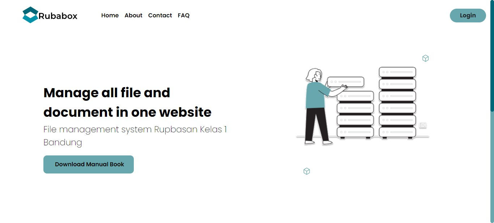

* About Page
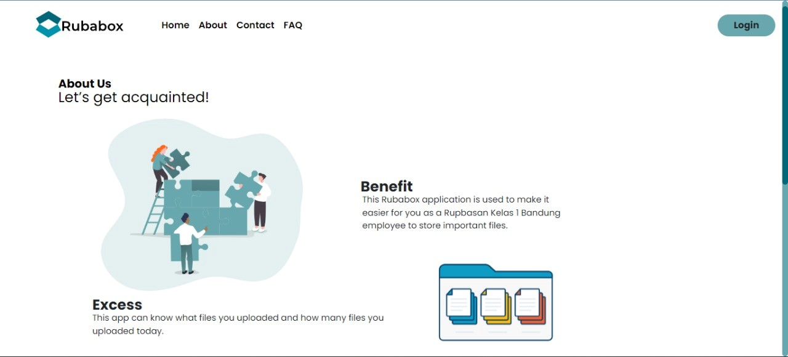

* Contact Page
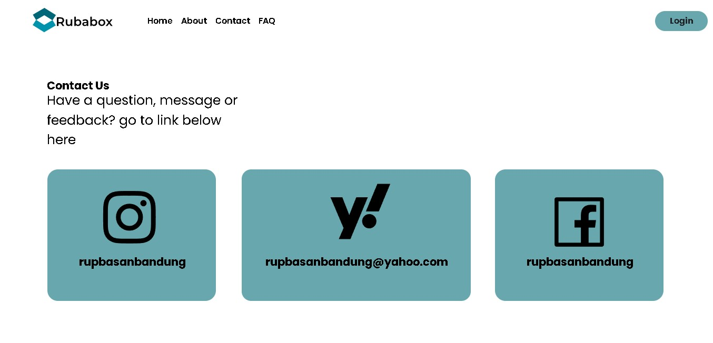

* FAQ Page
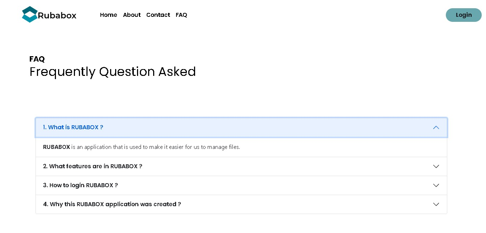

* Login Page
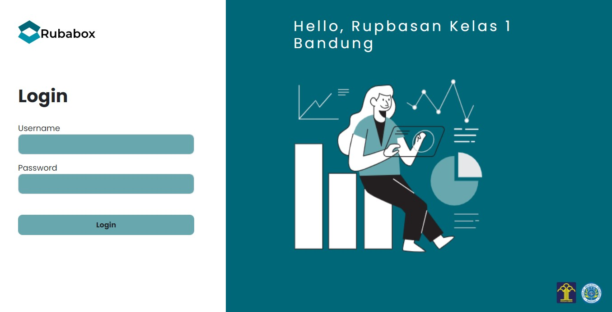

* Multiple Authentication (Autentikasi sebagai Admin atau User)

  Rubabox memisahkan antara penggunaan aplikasi sebagai Admin dan User. Hal ini bertujuan untuk mengefiesiensi pekerjaan dan menjaga setiap component yang berada di sistem dengan baik.

  sebagai Admin:
  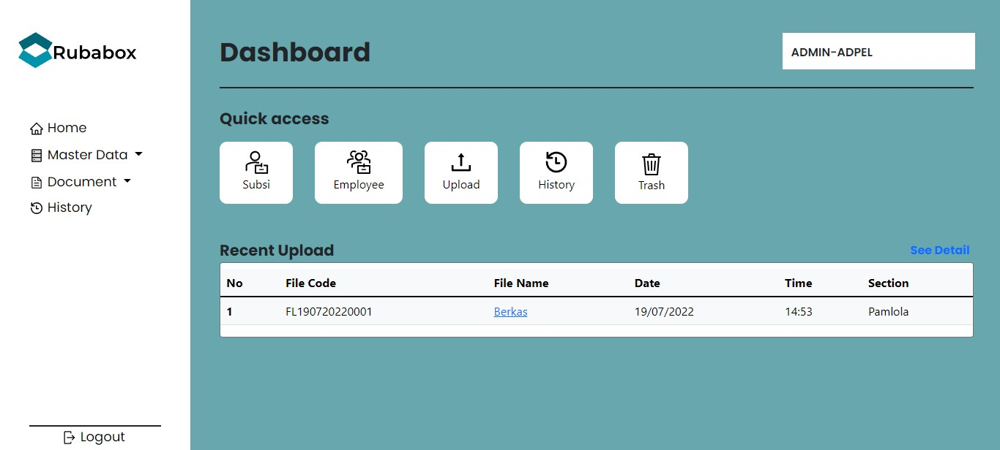

  sebagai User:
  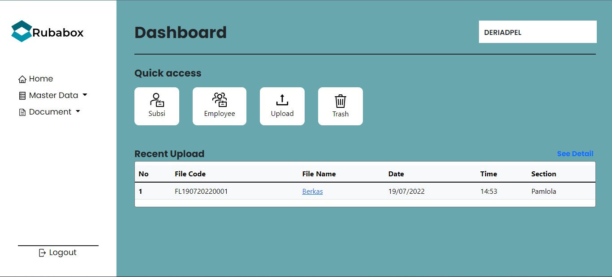

* Master Data (Admin, User, Subsi, Employee)

  Master Data merupakan fitur berupa data utama yang harus dibuat agar bisa melakukan sesuatu pada Rubabox, data tersebut digunakan sebagai acuan informasi untuk melakukan hal seperti input, login, edit dan hapus. Fitur master data ini terdiri atas beberapa tabel atau data diantaranya:

    1. Admin

       Master Data Admin berisi data berupa akun Admin yang bisa digunakan untuk mengakses Rubabox. Hanya Admin saja yang bisa melihat data, menambah data, mengubah data dan menghapus data pada Master Data Admin.
       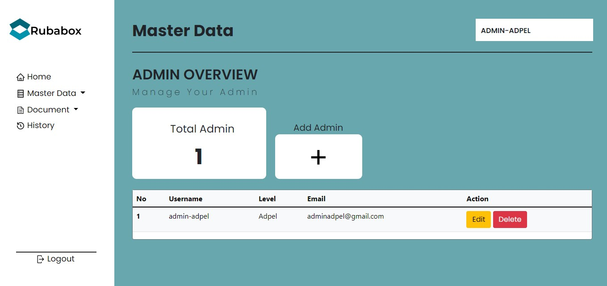

    2. User

       Master Data User berisi data berupa akun User yang bisa digunakan untuk mengakses Rubabox. Data User ini berkaitan dengan Master Data Employee karena User merupakan pegawai Rupbasan Kelas 1 Bandung, sehingga mempermudah tracking pada User. Hanya Admin saja yang bisa melihat data, menambah data, mengubah data dan menghapus data pada Master Data User. 
       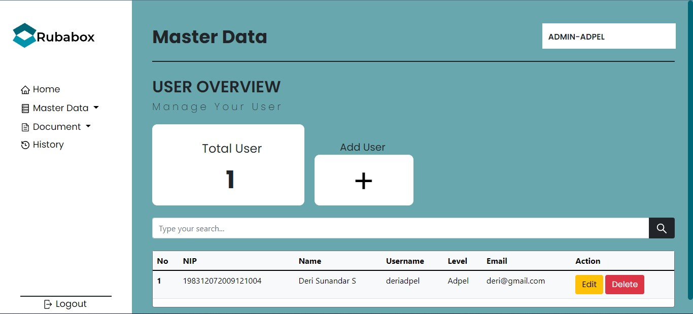

    3. Subsi

       Master Data Subsi berisi data yang berisi Subsi atau Divisi yang berada di Rupbasan Kelas 1 Bandung. Dapat dikatakan Master Data Subsi merupakan pusat informasi dari setiap fitur yang berada pada Rubabox. Hanya Admin saja yang bisa menambah data, mengubah data dan menghapus data pada Master Data Subsi.
       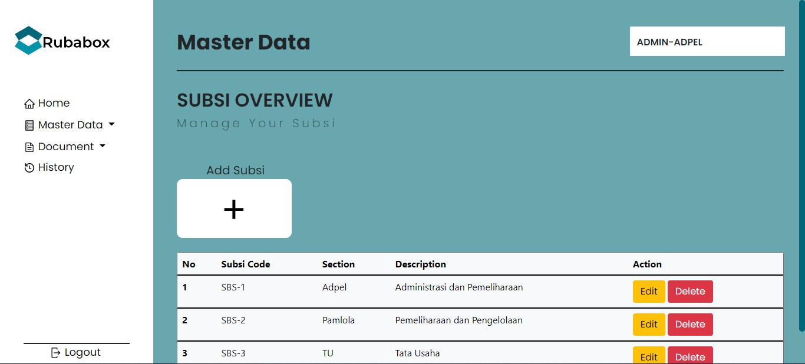

    4. Employee

       Master Data Employee berisi data yang berisi pegawai yang berada di Rupbasan Kelas 1 Bandung. Data pegawai ini juga bagian yang tidak kalah penting dari data subsi yang menjadi acuan informasi dari Master Data User. Hanya Admin saja yang bisa menambah data, mengubah data dan menghapus data pada Master Data Employee. 
       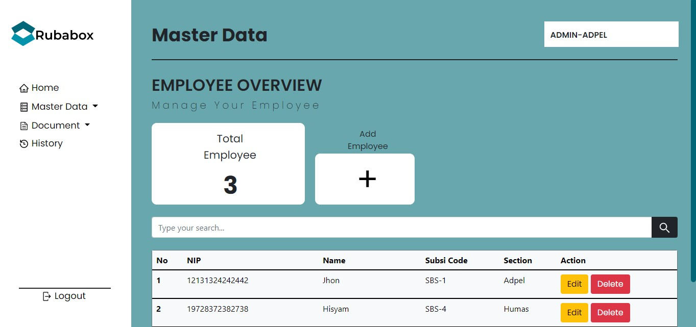

* Document (Upload dan Trash)

  Document merupakan fitur pengumpulan, penyimpanan dan pengelolaan informasi dalam bentuk cetakan atau gambar elektronik yang dapat dipakai sebagai bukti atau keterangan. Di dalam document juga terdapat dua fitur yaitu:

    1. Upload

       Upload merupakan fitur utama pada Rubabox. Di Rubabox kamu tidak hanya dapat mengupload file saja, tetapi bisa melihat atau mendownload file yang sudah diupload. Tidak hanya itu saja kamu bisa mencari file yang dibutuhkan dengan hanya mengetik nama file atau mencari berdasarkan tanggal uploadnya. Rubabox mempermudah itu semua. Baik Admin maupun User, pada bagian fitur Upload dapat melihat data, menambah data, mengubah data, dan menghapus data.
       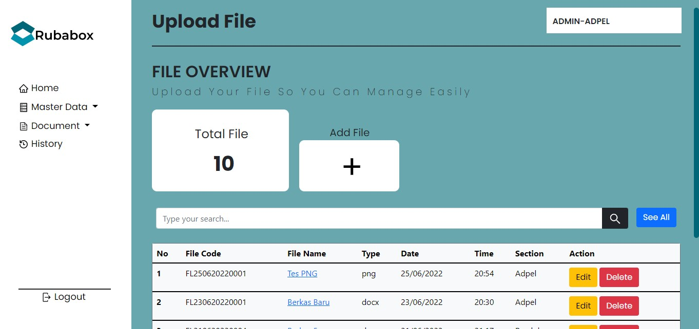

    2. Trash

       Trash adalah fitur penyimpanan sementara dari penghapusan file pada fitur Upload. Pada saat menghapus data file, file tersebut tidak langsung terhapus di database tetapi disimpan di Trash sebagain penyimpanan. Baik Admin maupun User bisa mengembalikan file yang sudah dihapus sementara dan menghapus secara permanen di fitur trash ini. 
       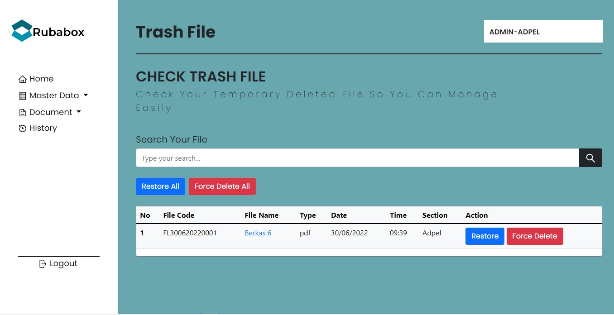

* History

  History merupakan fitur untuk tracking pengguna dalam setiap aktivitas fitur yang digunakan baik aktivitas Admin maupun User. Fitur ini merupakan fitur khusus yang diberlakukan untuk Admin.
  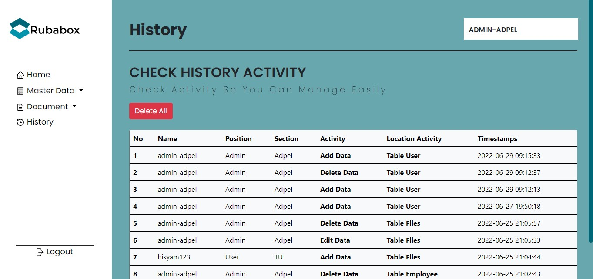
